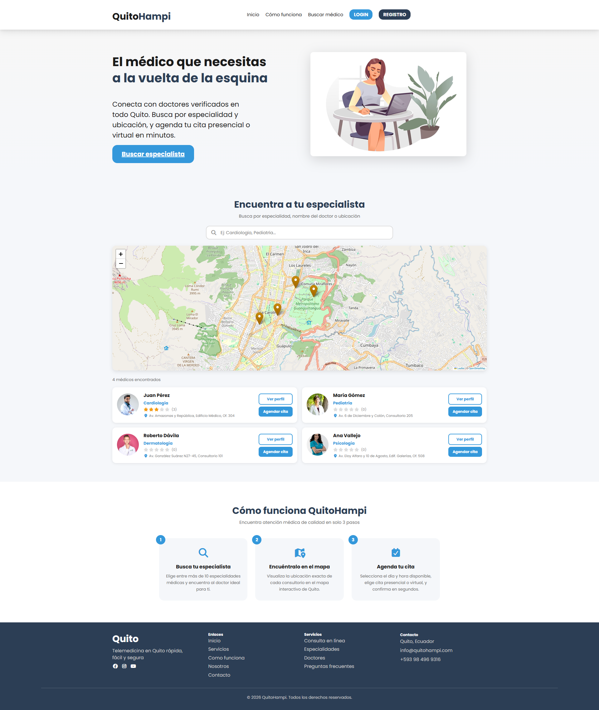

# QuitoHampi

Repositorio para el proyecto de Gestión, un proyecto de "salud a la vuelta de tu casa".

Plataforma web que conecta pacientes con doctores verificados en Quito mediante búsqueda por especialidad, geolocalización en mapa interactivo y agendamiento de citas presenciales o virtuales.

## Tecnologías

React 18 · Vite · Leaflet.js · Express.js · Supabase · JWT
